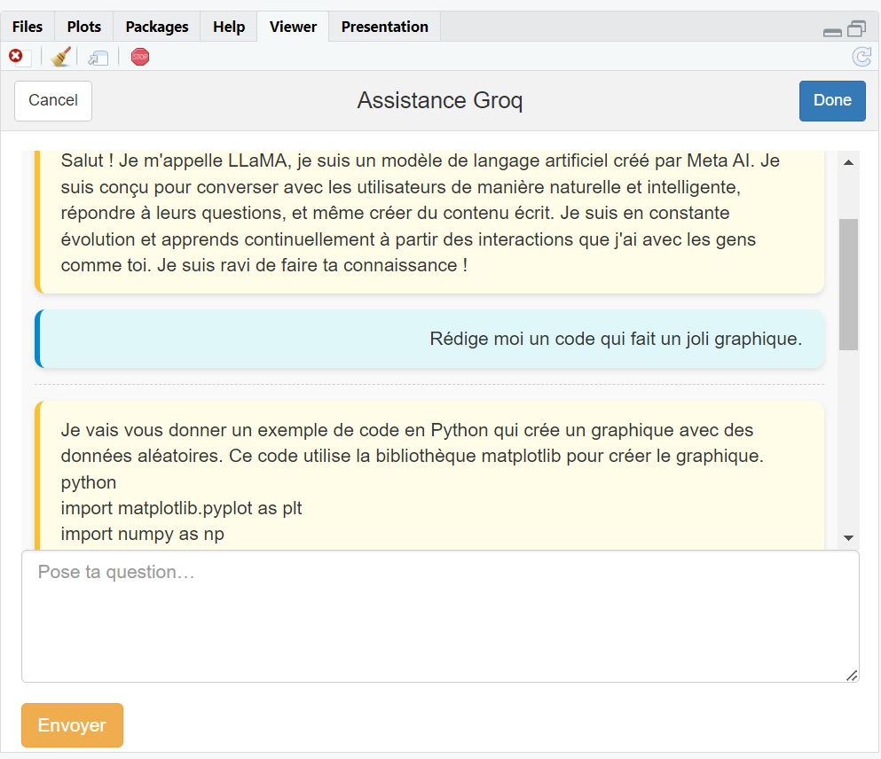

# AIAddin

**AIAddin** est un package R qui fournit trois Addins RStudio sous forme de gadgets Shiny pour interroger :
- **DeepSeek** (`deepseek_addin()`)
- **ChatGPT** (`chatgpt_addin()`)
- **Groq** (`groq_addin()`)

Chaque Addin s’ouvre dans l’onglet **Viewer** de RStudio (ou en fenêtre modale) et affiche vos échanges sous forme de bulles, avec un séparateur clair entre chaque question et réponse.

---

## 🚀 Installation

```r
# Installe le package remotes si besoin
install.packages("remotes")

# Puis :
remotes::install_github(
  repo   = "Khadidiatou1010/IA_with_R_project",
  subdir = "AIAddin",
  dependencies = TRUE
)
```

## ⚙️ Configuration des clés API

Avant d’utiliser les Addins, vous devez définir **vos propres clés** dans votre fichier `~/.Renviron`. 
AIAddin lit trois variables d’environnement :

| Variable               | Service                | Exemple                                |
|------------------------|------------------------|----------------------------------------|
| `DEEPSEEK_API_KEY`     | DeepSeek               | `sk-deepseek-abcdef123456…`            |
| `OPENROUTER_API_KEY`   | ChatGPT via OpenRouter | `sk-openrouter-uvwxyz789012…`          |
| `GROQ_API_KEY`         | Groq                   | `gsk-groq-3456mnop…`                   |


> **Astuce** : vous pouvez aussi utiliser, et c'est ce qui est préférable, la fonction `api_config()` :
>
> ```r
> library(AIAddin)
> AIAddin::api_config(
>   deepseek   = "sk-deepseek-abcdef123456…",
>   openrouter = "sk-openrouter-uvwxyz789012…",
>   groq       = "gsk-groq-3456mnop…"
> )
> ```
> Elle ajoutera/mènera à jour vos clés dans `~/.Renviron`. Vous devez définir au moins uen API pour pouvoir utiliser l'addin concerné.


## Utilisation 

Une fois installé, il suffit d'appeler les fonctions

```r
library(IAAddin)
IAAddin::deepseek_addin()
IAAddin::chatgpt_addin()
IAAddin::groq_addin()
```

De plus, tes trois Addins (DeepSeek, ChatGPT, Groq) seront disponibles dans **Addins → Browse Addins…**.


Vous pouvez maintenant discuter avec votre IA sur l'onglet Viewer !
Happy vibe coding!




